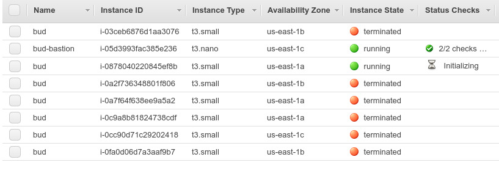

{:title "AWS Battles, Episode 1", :date "2019-12-27"}

I'm starting a new series. Whenever I start thinking about how much work it
might take to ditch AWS and Datomic Ions and set up Datomic On-Prem on
DigitalOcean instead, I'm going to write a blog post about what happened.

I made the mistake of trying to deploy code to my Datomic system today. As
usual, the deploy failed shortly after initiating it:

```bash
$ iondeploy  # My deploy script. It prints the status every 3 seconds.
...
{:deploy-status "RUNNING", :code-deploy-status "RUNNING"}
{:deploy-status "RUNNING", :code-deploy-status "RUNNING"}
{:deploy-status "RUNNING", :code-deploy-status "RUNNING"}
{:deploy-status "RUNNING", :code-deploy-status "RUNNING"}
{:deploy-status "RUNNING", :code-deploy-status "RUNNING"}
{:deploy-status "FAILED", :code-deploy-status "FAILED"}
```

A successful deploy usually has about 15 status lines. If it fails after four
or five lines, that means the deploy had an out-of-memory error. (If there are
30+ status lines before failure, that means it's the dreaded
arggh-`ValidateService`-failed-again error).

Usually, at this point I would log into the EC2 console, terminate the compute
instance, wait for the auto scaling group to bring another instance up, and
then deploy (and sigh wistfully... "if only the solo topology didn't use
a weenie `t3.small` instance"). But since this is a near-daily occurrence for me,
I decided to figure out how to terminate the instance using the AWS CLI instead.

Here's the result (thanks [Borkdude](https://github.com/borkdude/babashka)!):
```clojure
#!/bin/bash
# vim: ft=clojure
id=$(aws ec2 describe-instances | bb -i '
(->> *input*
     (str/join "")
     (#(json/parse-string % true))
     :Reservations
     (mapcat :Instances)
     (filter (fn [{:keys [Tags]}]
               (->> Tags
                    (filter #(= "Name" (:Key %)))
                    first
                    :Value
                    (= "bud"))))
     first
     :InstanceId
     println)')

aws ec2 terminate-instances --instance-ids $id
watch aws ec2 describe-instance-status
```

("bud" is my Datomic application name, chosen because the first app I made on
this system was a budgeting app. It may not have any meaning now, but at least
it's short and easy to remember, like all good variable names.)

Something went wrong though. Maybe there's some kind of difference between
terminating an instance from the command line or from the EC2 console,
although my guess is it was just a coincidence. Fate is punishing me for my
existence. Anyway, the instances kept dying whenever the auto scaling group
tried to bring another one up:



It was stuck in a loop of trying to boot instances only to have them come
dead-on-arrival. Actually that wouldn't normally be a problem: I noticed
recently that often, the first one or two new instances would die, followed by a
successfully booted instance. But this time they just kept dying, as if it
was some kind of zombie apocalypse.

Today I learned that you can easily view the system logs for an instance
from the EC2 console (under Actions -> Instance Settings -> Get System Log),
after which I found the culprit:

```bash
login: /dev/fd/11: line 1: /sbin/plymouthd: No such file or directory
```

I don't know what the deal with that is, but I searched for the error, and
someone on StackExchange said it was because something was wrong with something
else, so I decided to try deleting and re-creating the CloudFormation stack. I
wasn't sure if that was an OK thing to do or not (I'm not exactly an AWS
expert, in case you haven't already guessed), but I checked the [Datomic docs](https://docs.datomic.com/cloud/operation/deleting.html#deleting-stacks),
and huzzah, it is an OK thing to do.

One stack deletion later, I find that my compute stack is stuck in a `DELETE_IN_PROGRESS`
state. Boo. I did a search for force-deleting a stack and found
[this thread](https://forums.aws.amazon.com/thread.jspa?threadID=148754&start=0&tstart=0)
on the AWS forums. It contained the sad tale of Eric, an AWS customer trying to
do something that wasn't working. Halfway down the page, and after several usages of
the word "unacceptable," I felt like I was right there with Eric. "Yeah, I hate
AWS too!" (Maybe 2020 will be the year of Datomic-Cloud-Ions-on-the-Firebase).

Fortunately, the very last post in that thread (from just last October, five years after Eric's original
post&mdash;hopefully his stack has finished deleting by now) contained a link to
[a document](https://aws.amazon.com/premiumsupport/knowledge-center/cloudformation-lambda-resource-delete/)
for troubleshooting this very issue. Hallelujah.

It had two sections, one for fixing `DELETE_FAILED` and one for fixing
`DELETE_IN_PROGRESS`. I went to the latter section. Everything was going great until about
halfway through step 1. I had downloaded Datomic's CloudFormation template, I
did a search for `ServiceToken`... and got five or seven results, with no idea
how to `identify the name of the Lambda function where your custom resource is
sending requests`. Maybe I should just pick one? There were a couple that had "Delete"
in the name, that sounds promising....

I was saved by the bell. I switched back to the CloudFormation console and
found that my stack had switched from `DELETE_IN_PROGRESS` to `DELETE_FAILED`. That
meant I could try the other set of instructions! My heart soared. (Well, it at least
picked up a little). The instructions for fixing `DELETE_FAILED` were much simpler.
I was confronted with a dialog and two checkboxes and a charge to
`choose the custom resource that's stuck in the DELETE_FAILED status`. Unsure
of which one to pick, I selected both of them (I think... or maybe I left both
of them unselected. I think I selected them though). After that, the stack
finally deleted. The worst was over.

Then it was just a little cleanup. I [re-enabled SSH access to the
bastion](https://docs.datomic.com/cloud/getting-started/configuring-access.html#authorize-gateway),
re-deployed my Datomic application (successfully!), and then fiddled with API
Gateway until it forwarded requests to the newly created Lambdas. That involved
deleting-and-recreating the Lambda proxy resource for each API while muttering the
correct incantations so as not to offend the CORS gods.

At last, after only two-ish hours of down-time, the three apps I'm hosting on
Datomic are up and running again. Well, not including [one of
them](https://notjust.us)&mdash; I'm still waiting on a bugfix before that one
will work again. :)
